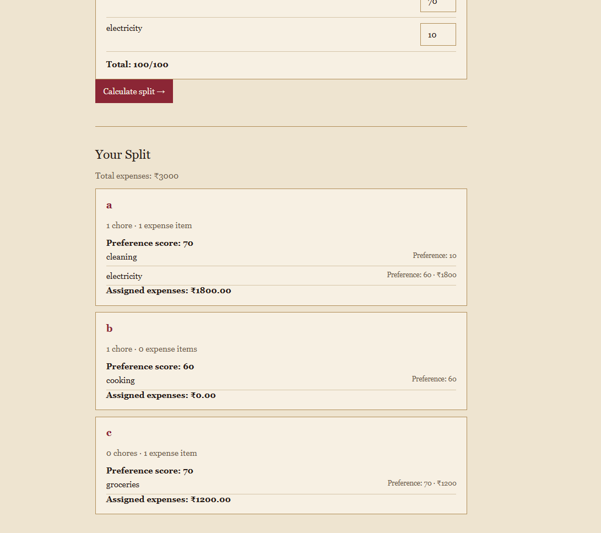

# Splitzy

**A preference-based way to split chores & expenses.**

Splitzy helps roommates divide shared tasks and expenses based on what each person actually prefers — instead of simply splitting everything equally.

## Preview

###  Features

-  Roommate management
-  Chore & expense allocation
-  Preference-based splitting
-  Smart tie-breaking
-  Expense tracking
-  Save & load splits

###  Built With

React · TypeScript · Vite · CSS

## How it works

Each roommate assigns preference points to the available chores and expenses.

Splitzy uses those preferences to allocate items. When preferences are tied, it balances the allocation using the number of assigned items, assigned expense value, and assignment history.

Expenses are assigned to the roommate who receives them rather than being automatically divided equally.